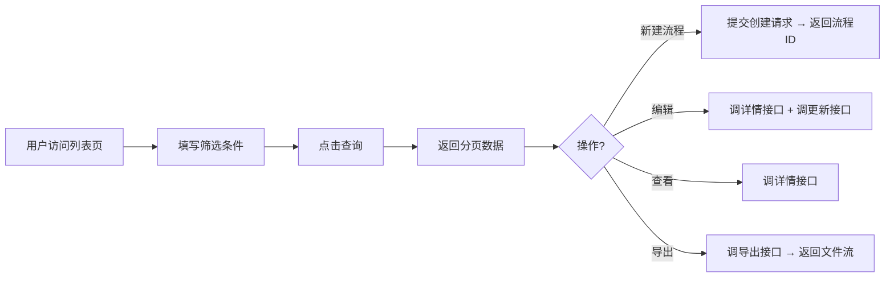
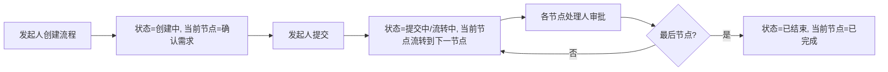
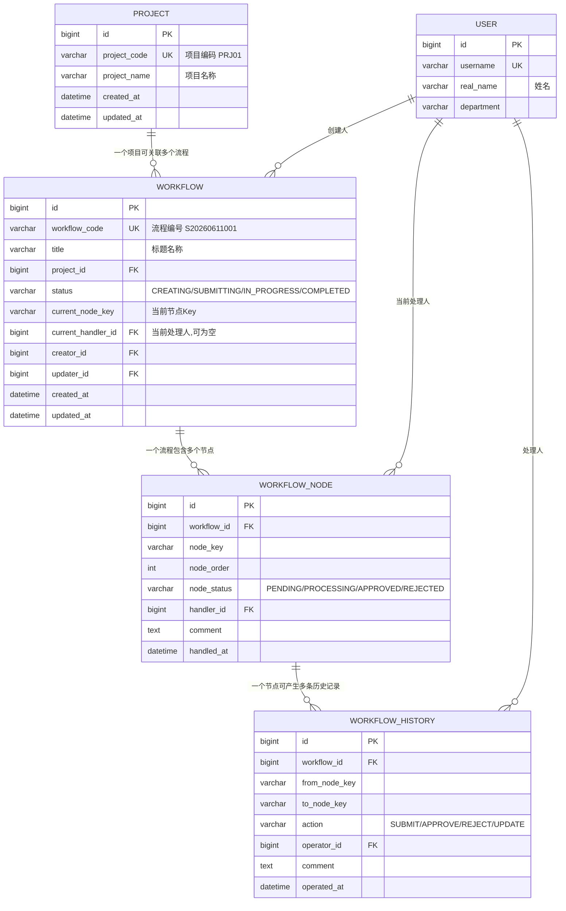
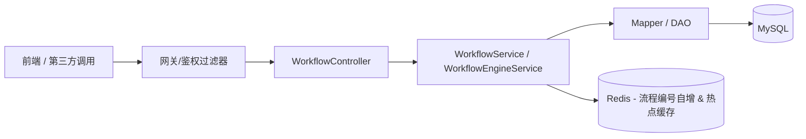

# 项目标准确认流程管理系统 — 后端开发 PRD

> 文档版本：V1.0  
> 撰写日期：2026-06-16  
> 适用范围：后端开发（Controller / Service / DAO / 数据库 / API）

---

## 1. 产品概述

### 1.1 背景与目标

企业内部需要对"项目标准确认"工作进行**全流程的规范化管理**，从需求确认 → 制定标准 → 标准评审 → 标准会签 → 标准汇总 → 完成，形成一条可追踪的审批链。当前页面是该系统的**流程列表入口页**，负责流程的**检索、创建、编辑、查看、导出**等入口操作。

### 1.2 价值

- 让每个项目的标准确认工作**有迹可循、有据可依**。
- 通过**统一的流程引擎 + 节点状态**，实现跨部门协作。
- 提供**多维筛选 + 分页 + 导出**，方便管理层统计与审计。

### 1.3 目标用户

| 角色 | 场景 |
|------|------|
| 流程发起人（项目负责人） | 新建流程、查看自己发起的流程、编辑草稿 |
| 各节点处理人 | 处理"当前节点"指派给自己的流程 |
| 管理员 / 质量部 | 全量查询、导出、审计所有流程 |

---

## 2. 功能需求（Functional Requirements）

### 2.1 页面与模块映射

| 模块 | 前端页面功能 | 对应后端能力 |
|------|-------------|-------------|
| 筛选区（12 个筛选条件） | 状态 / 流程编号 / 标题名称 / 当前节点 / 当前处理人 / 项目编码 / 项目名称 / 创建人 / 创建时间 / 更新人 / 更新时间 → 查询 / 重置 | 提供分页+多条件组合查询接口 |
| 操作按钮 | + 新建流程 | 提供"创建流程"接口，初始化首节点 |
| 操作按钮 | 导出 | 提供列表导出接口（Excel / CSV） |
| 列表表格 | 35 条记录，支持分页、排序 | 分页查询接口，排序参数（按创建时间 / 更新时间） |
| 操作列 | 编辑、查看 | 提供详情查询接口 + 更新基础字段接口 |

### 2.2 流程状态字典

| 状态 Key | 显示名称 | 说明 |
|----------|---------|------|
| `CREATING` | 创建中 | 已创建但尚未提交 |
| `SUBMITTING` | 提交中 | 已提交，正在首个节点处理 |
| `IN_PROGRESS` | 流转中 | 流程在中间节点推进 |
| `COMPLETED` | 已结束 | 流程走完所有节点 |

### 2.3 流程节点字典（当前节点）

| 节点 Key | 显示名称 | 排序顺序 |
|----------|---------|---------|
| `NODE_REQUIREMENT_CONFIRM` | 确认需求 | 1 |
| `NODE_STANDARD_DRAFT` | 制定标准 | 2 |
| `NODE_STANDARD_REVIEW` | 标准评审 | 3 |
| `NODE_STANDARD_COSIGN` | 标准会签 | 4 |
| `NODE_STANDARD_SUMMARY` | 标准汇总 | 5 |
| `NODE_COMPLETED` | 已完成 | 6 |

---

## 3. 业务流程（Business Flow）

### 3.1 主业务流程（Mermaid）



### 3.2 流程推进流程（Mermaid）



---

## 4. 数据模型设计（Data Model）

### 4.1 ER 图（Mermaid）



### 4.2 表结构 DDL（MySQL）

```sql
-- =================================================
-- 项目表
-- =================================================
CREATE TABLE `project` (
  `id`           BIGINT       NOT NULL AUTO_INCREMENT COMMENT '主键ID',
  `project_code` VARCHAR(32)  NOT NULL COMMENT '项目编码, 如 PRJ01',
  `project_name` VARCHAR(128) NOT NULL COMMENT '项目名称',
  `description`  VARCHAR(512)          DEFAULT NULL COMMENT '项目描述',
  `is_deleted`   TINYINT(1)   NOT NULL DEFAULT 0 COMMENT '逻辑删除标识',
  `created_at`   DATETIME     NOT NULL DEFAULT CURRENT_TIMESTAMP,
  `updated_at`   DATETIME     NOT NULL DEFAULT CURRENT_TIMESTAMP
                           ON UPDATE CURRENT_TIMESTAMP,
  PRIMARY KEY (`id`),
  UNIQUE KEY `uk_project_code` (`project_code`),
  KEY `idx_project_name` (`project_name`)
) ENGINE=InnoDB DEFAULT CHARSET=utf8mb4 COMMENT='项目表';


-- =================================================
-- 流程表
-- =================================================
CREATE TABLE `workflow` (
  `id`                  BIGINT       NOT NULL AUTO_INCREMENT COMMENT '主键ID',
  `workflow_code`       VARCHAR(32)  NOT NULL COMMENT '流程编号, 如 S20260611001',
  `title`               VARCHAR(128) NOT NULL COMMENT '标题名称',
  `project_id`          BIGINT       NOT NULL COMMENT '关联项目ID',
  `status`              VARCHAR(32)  NOT NULL DEFAULT 'CREATING' COMMENT '流程状态: CREATING/SUBMITTING/IN_PROGRESS/COMPLETED',
  `current_node_key`    VARCHAR(64)           DEFAULT NULL COMMENT '当前节点Key',
  `current_handler_id`  BIGINT                DEFAULT NULL COMMENT '当前处理人ID, 可为空',
  `creator_id`          BIGINT       NOT NULL COMMENT '创建人ID',
  `updater_id`          BIGINT       NOT NULL COMMENT '更新人ID',
  `is_deleted`          TINYINT(1)   NOT NULL DEFAULT 0,
  `created_at`          DATETIME     NOT NULL DEFAULT CURRENT_TIMESTAMP,
  `updated_at`          DATETIME     NOT NULL DEFAULT CURRENT_TIMESTAMP
                                  ON UPDATE CURRENT_TIMESTAMP,
  PRIMARY KEY (`id`),
  UNIQUE KEY `uk_workflow_code` (`workflow_code`),
  KEY `idx_project_id`   (`project_id`),
  KEY `idx_status`       (`status`),
  KEY `idx_creator_id`   (`creator_id`),
  KEY `idx_current_handler` (`current_handler_id`),
  KEY `idx_created_at`   (`created_at`)
) ENGINE=InnoDB DEFAULT CHARSET=utf8mb4 COMMENT='流程表';


-- =================================================
-- 流程节点表
-- =================================================
CREATE TABLE `workflow_node` (
  `id`          BIGINT     NOT NULL AUTO_INCREMENT,
  `workflow_id` BIGINT     NOT NULL COMMENT '所属流程ID',
  `node_key`    VARCHAR(64) NOT NULL COMMENT '节点Key',
  `node_order`  INT        NOT NULL COMMENT '节点顺序,从1开始',
  `node_status` VARCHAR(32) NOT NULL DEFAULT 'PENDING' COMMENT 'PENDING/PROCESSING/APPROVED/REJECTED',
  `handler_id`  BIGINT              DEFAULT NULL COMMENT '处理人ID',
  `comment`     TEXT                 COMMENT '节点处理意见',
  `handled_at`  DATETIME             DEFAULT NULL COMMENT '处理时间',
  `created_at`  DATETIME   NOT NULL DEFAULT CURRENT_TIMESTAMP,
  PRIMARY KEY (`id`),
  UNIQUE KEY `uk_workflow_node` (`workflow_id`, `node_key`),
  KEY `idx_workflow_id` (`workflow_id`)
) ENGINE=InnoDB DEFAULT CHARSET=utf8mb4 COMMENT='流程节点表';


-- =================================================
-- 流程历史记录表
-- =================================================
CREATE TABLE `workflow_history` (
  `id`            BIGINT      NOT NULL AUTO_INCREMENT,
  `workflow_id`   BIGINT      NOT NULL,
  `from_node_key` VARCHAR(64)          DEFAULT NULL COMMENT '源节点,创建时为空',
  `to_node_key`   VARCHAR(64)          DEFAULT NULL COMMENT '目标节点',
  `action`        VARCHAR(32) NOT NULL COMMENT 'SUBMIT/APPROVE/REJECT/UPDATE',
  `operator_id`   BIGINT      NOT NULL COMMENT '操作人ID',
  `comment`       TEXT                 COMMENT '操作备注',
  `operated_at`   DATETIME    NOT NULL DEFAULT CURRENT_TIMESTAMP,
  PRIMARY KEY (`id`),
  KEY `idx_workflow_id` (`workflow_id`)
) ENGINE=InnoDB DEFAULT CHARSET=utf8mb4 COMMENT='流程历史表';


-- =================================================
-- 用户表
-- =================================================
CREATE TABLE `user` (
  `id`         BIGINT       NOT NULL AUTO_INCREMENT,
  `username`   VARCHAR(64)  NOT NULL COMMENT '登录账号',
  `real_name`  VARCHAR(64)  NOT NULL COMMENT '真实姓名,用于列表展示',
  `department` VARCHAR(128)          DEFAULT NULL COMMENT '部门',
  `is_active`  TINYINT(1)   NOT NULL DEFAULT 1,
  `created_at` DATETIME     NOT NULL DEFAULT CURRENT_TIMESTAMP,
  PRIMARY KEY (`id`),
  UNIQUE KEY `uk_username` (`username`)
) ENGINE=InnoDB DEFAULT CHARSET=utf8mb4 COMMENT='用户表';
```

### 4.3 数据字典

**workflow.status**：`CREATING`（创建中） / `SUBMITTING`（提交中） / `IN_PROGRESS`（流转中） / `COMPLETED`（已结束）。

**workflow_node.node_status**：`PENDING`（待处理） / `PROCESSING`（处理中） / `APPROVED`（通过） / `REJECTED`（驳回）。

**workflow_history.action**：`CREATE` / `SUBMIT` / `APPROVE` / `REJECT` / `UPDATE` / `COMPLETE`。

---

## 5. 非功能需求（Non-Functional Requirements）

| 维度 | 要求 |
|------|------|
| 性能 | 列表查询在 50 万条数据内，响应时间 ≤ 1s；导出 ≤ 10s（35 条/页场景 ≤ 2s） |
| 可用性 | 99.5%；支持滚动发布，不中断正在处理的流程 |
| 并发 | 支持同时发起 / 处理 100+ 流程；使用乐观锁防止状态回滚 |
| 安全 | 接口需鉴权（JWT）；列表按角色过滤；不允许越权编辑他人流程 |
| 可观测性 | 所有核心接口需打印请求/响应日志；关键操作（提交 / 审批）写入 `workflow_history` 表 |
| 扩展性 | 节点配置需基于"字典表/配置"，不能硬编码；未来可自由新增节点 |

---

## 6. API 接口设计（RESTful）

> 统一前缀：`/api/v1`  
> 统一响应：`{ "code": 0, "message": "success", "data": {...} }`  
> 鉴权：请求头 `Authorization: Bearer <JWT>`

### 6.1 流程列表 — 分页多条件查询

**`POST /api/v1/workflows/query`**

| 功能 | 请求方法 | URL |
|------|---------|-----|
| 分页 + 多条件查询流程列表 | POST | `/api/v1/workflows/query` |

**Request Body：**

```json
{
  "status": "CREATING",
  "workflowCode": "S20260611001",
  "title": "项目标准确认流程",
  "currentNodeKey": "NODE_REQUIREMENT_CONFIRM",
  "currentHandlerName": "张三",
  "projectCode": "PRJ01",
  "projectName": "XX型号研发项目",
  "creatorName": "周工",
  "createdAtStart": "2026-05-12 00:00:00",
  "createdAtEnd": "2026-06-16 23:59:59",
  "updaterName": "吴工",
  "updatedAtStart": "2026-05-14 00:00:00",
  "updatedAtEnd": "2026-06-16 23:59:59",
  "pageNum": 1,
  "pageSize": 10,
  "orderBy": "createdAt",
  "orderDir": "desc"
}
```

> 所有筛选条件**均可为空**，为空代表不启用该条件。`status` / `currentNodeKey` 支持下拉多选（传数组）。

**Response：**

```json
{
  "code": 0,
  "message": "success",
  "data": {
    "total": 35,
    "pageNum": 1,
    "pageSize": 10,
    "list": [
      {
        "id": 1,
        "workflowCode": "S2026061601",
        "title": "XX型号研发项目标准确认流程",
        "status": "CREATING",
        "statusText": "创建中",
        "currentNodeKey": "NODE_REQUIREMENT_CONFIRM",
        "currentNodeText": "确认需求",
        "currentHandlerName": "张三",
        "projectCode": "PRJ01",
        "projectName": "XX型号研发项目",
        "creatorName": "周工",
        "createdAt": "2026-05-12 10:07:00",
        "updaterName": "吴工",
        "updatedAt": "2026-05-14 15:07:00"
      }
    ]
  }
}
```

---

### 6.2 流程详情

**`GET /api/v1/workflows/{id}`**

**Response data：**

```json
{
  "id": 1,
  "workflowCode": "S2026061601",
  "title": "XX型号研发项目标准确认流程",
  "projectId": 1,
  "projectCode": "PRJ01",
  "projectName": "XX型号研发项目",
  "status": "IN_PROGRESS",
  "statusText": "流转中",
  "currentNodeKey": "NODE_STANDARD_REVIEW",
  "currentNodeText": "标准评审",
  "currentHandlerName": "王五",
  "creatorName": "周工",
  "updaterName": "吴工",
  "createdAt": "2026-05-12 10:07:00",
  "updatedAt": "2026-05-14 15:07:00",
  "nodes": [
    { "nodeKey": "NODE_REQUIREMENT_CONFIRM", "nodeText": "确认需求", "status": "APPROVED", "handlerName": "张三", "handledAt": "2026-05-13 09:00:00" },
    { "nodeKey": "NODE_STANDARD_DRAFT",       "nodeText": "制定标准", "status": "APPROVED", "handlerName": "李四", "handledAt": "2026-05-14 08:00:00" },
    { "nodeKey": "NODE_STANDARD_REVIEW",      "nodeText": "标准评审", "status": "PROCESSING", "handlerName": "王五" },
    { "nodeKey": "NODE_STANDARD_COSIGN",      "nodeText": "标准会签", "status": "PENDING" },
    { "nodeKey": "NODE_STANDARD_SUMMARY",     "nodeText": "标准汇总", "status": "PENDING" },
    { "nodeKey": "NODE_COMPLETED",            "nodeText": "已完成",   "status": "PENDING" }
  ]
}
```

---

### 6.3 新建流程

**`POST /api/v1/workflows`**

**Request Body：**

```json
{
  "title": "GG自动化改造项目标准确认流程",
  "projectId": 10,
  "remark": "请尽快推进首节点"
}
```

**Response data：**

```json
{
  "id": 36,
  "workflowCode": "S20260616036"
}
```

> 新建时：
> - `status` = `CREATING`
> - `current_node_key` = `NODE_REQUIREMENT_CONFIRM`（首节点）
> - 自动生成 `workflow_code`：`S + yyyyMMdd + 3位序号`
> - `creator_id` / `updater_id` 取当前登录用户
> - 同步在 `workflow_node` 中按节点字典初始化 6 条节点记录
> - 写入 `workflow_history`：`action=CREATE`

---

### 6.4 编辑流程（基础字段编辑）

**`PUT /api/v1/workflows/{id}`**

> 仅允许 `status = CREATING`（创建中）时编辑基础字段，或由管理员编辑；其他状态下禁止修改标题 / 项目。

**Request Body：**

```json
{
  "title": "GG自动化改造项目标准确认流程（修改后标题）",
  "projectId": 10
}
```

**Response data：**

```json
{ "affected": 1 }
```

---

### 6.5 提交流程（推进到下一节点）

**`POST /api/v1/workflows/{id}/submit`**

**Request Body：**

```json
{
  "comment": "同意，推进到下一节点"
}
```

**Response data：**

```json
{
  "newNodeKey": "NODE_STANDARD_DRAFT",
  "newNodeText": "制定标准"
}
```

> 业务规则：
> 1. 检查当前节点处理人是否为当前登录用户（越权校验）。
> 2. 当前节点状态从 `PROCESSING` → `APPROVED`，记录 `handled_at`。
> 3. 根据 `node_order` 找到下一节点；若已到最后节点（`NODE_COMPLETED`），将 `workflow.status` 置为 `COMPLETED`。
> 4. 下一节点 `node_status` 置为 `PROCESSING`。
> 5. 写入 `workflow_history`：`action=APPROVE` 或 `action=COMPLETE`。

---

### 6.6 导出列表

**`POST /api/v1/workflows/export`**

入参与 6.1 完全一致（不含 `pageNum/pageSize`），服务端按筛选条件**全量导出**为 Excel 文件，返回：

```
Content-Type: application/vnd.openxmlformats-officedocument.spreadsheetml.sheet
Content-Disposition: attachment; filename="workflow-20260616.xlsx"
```

---

### 6.7 其他辅助接口

| 方法 | URL | 说明 |
|------|-----|------|
| GET | `/api/v1/dict/workflow-status` | 返回状态字典（供筛选下拉） |
| GET | `/api/v1/dict/workflow-nodes` | 返回节点字典（供筛选下拉） |
| GET | `/api/v1/projects` | 项目下拉列表（`{id, projectCode, projectName}`） |
| GET | `/api/v1/users` | 用户下拉列表（用于选人） |

---

## 7. 服务端架构（Server Architecture）

### 7.1 分层架构图（Mermaid）



### 7.2 类职责

| 类 | 职责 |
|----|------|
| `WorkflowController` | 列表查询、详情、创建、编辑、提交、导出 |
| `WorkflowEngineService` | 流程推进逻辑（节点流转、状态变更、历史记录） |
| `WorkflowService` | 基础 CRUD、业务校验、编号生成 |
| `WorkflowMapper`（MyBatis）或 `WorkflowRepository`（JPA） | 与数据库交互 |
| `WorkflowCodeGenerator` | 唯一编号生成器（`SyyyyMMddNNN`），基于 Redis 自增保证并发安全 |

### 7.3 关键类的领域对象（Java DTO 示例）

```java
// --- 查询条件 ---
public class WorkflowQueryCondition {
    private String status;
    private String workflowCode;
    private String title;
    private String currentNodeKey;
    private String currentHandlerName;
    private String projectCode;
    private String projectName;
    private String creatorName;
    private LocalDateTime createdAtStart;
    private LocalDateTime createdAtEnd;
    private String updaterName;
    private LocalDateTime updatedAtStart;
    private LocalDateTime updatedAtEnd;
    private Integer pageNum = 1;
    private Integer pageSize = 10;
    private String orderBy = "createdAt";
    private String orderDir = "desc";
}

// --- 创建 DTO ---
public class WorkflowCreateDTO {
    @NotBlank private String title;
    @NotNull private Long projectId;
    private String remark;
}

// --- 提交 DTO ---
public class WorkflowSubmitDTO {
    private String comment;
}
```

---

## 8. 关键业务规则（Business Rules Checklist）

- [x] **BR01**：`workflow_code` 全局唯一，格式 `S + yyyyMMdd + 3位序号`，服务端生成，不允许前端传入。
- [x] **BR02**：创建人 = 当前登录用户；非管理员不能编辑他人流程。
- [x] **BR03**：流程推进必须按节点顺序推进，不可跳节点。
- [x] **BR04**：`status` 和 `current_node_key` 必须保持一致，由 `WorkflowEngineService` 统一写回。
- [x] **BR05**：`COMPLETED` / 已结束流程，不可再编辑标题、项目等基础字段。
- [x] **BR06**：筛选条件支持"模糊匹配"（`title / projectName / workflowCode`）与"精确匹配"（`status / nodeKey / user`）。
- [x] **BR07**：导出 Excel 列需与前端列表列严格一致（11 列 + 操作列不导出）。

---

## 9. 测试用例（关键用例摘要）

| 编号 | 用例 | 预期 |
|------|------|------|
| TC01 | 不填任何筛选条件，点查询 | 返回前 10 条（按创建时间倒序） |
| TC02 | 按 `status=流转中` 查询 | 只返回 `IN_PROGRESS` 流程 |
| TC03 | 同时使用 `创建人` + `项目编码` 查询 | 交集过滤正确 |
| TC04 | 点击"新建流程"，标题必填校验 | 缺少标题时返回 400 |
| TC05 | 流程编号唯一性校验 | 并发创建 100 个不会重复 |
| TC06 | 提交已结束流程 | 拒绝并返回业务错误码 |
| TC07 | 非当前处理人尝试审批 | 拒绝（越权） |
| TC08 | 导出 Excel，列名与前端一致 | 正常下载，格式正确 |

---

## 10. 里程碑与交付物（Milestones）

| 阶段 | 产出 | 预估周期 |
|------|------|---------|
| 1. 数据库设计评审 | ER 图 / DDL / 数据字典 | 1 天 |
| 2. API 接口评审 | 接口契约文档（Swagger / Postman Collection） | 1 天 |
| 3. 后端实现 | Controller / Service / Mapper / 流程引擎 | 5 个工作日 |
| 4. 单元测试 + 集成测试 | JUnit / TestContainers，覆盖率 ≥ 70% | 2 个工作日 |
| 5. 联调与交付 | 与前端联调，输出部署脚本、接口 Mock 数据 | 1 个工作日 |

---

**END**
